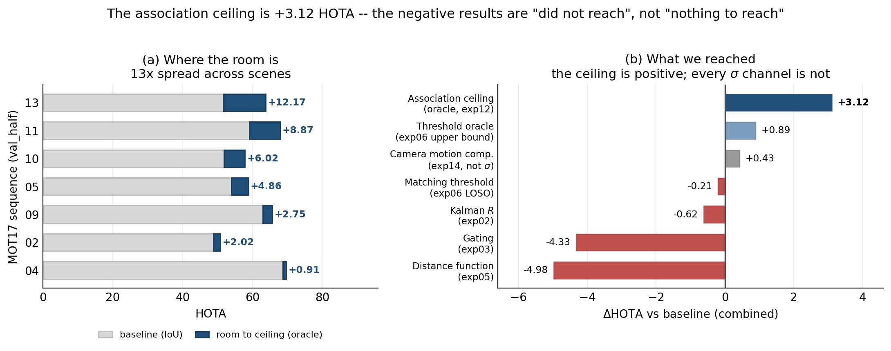
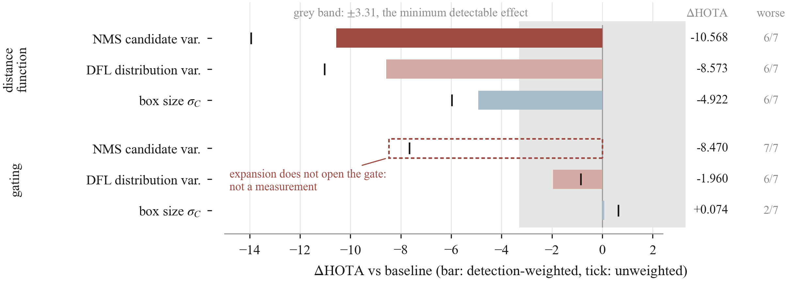
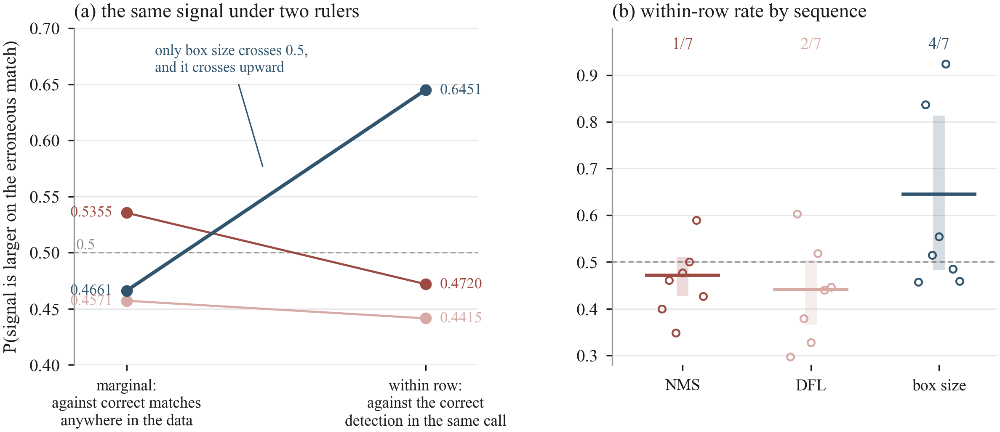

<div align="center">

# Is Detection Uncertainty Usable for Data Association?

**Does injecting the detector's localization uncertainty σ into the association cost of
multi-object tracking make tracking better?** This repository asks that question under
controlled conditions. The answer is **no** — and the cause is not the injection form,
it is **σ itself**.

JunHyeong Park · Department of Data Science, Inha University

[한국어 README](README.ko.md) · **[read the manuscript (PDF, Korean, 53 pp.)](paper/report.pdf)** · [source](paper/report.tex)

</div>

> A research-notebook repository that publishes **what was wrong and why**, not only what worked.
> **18 conclusions have been retracted so far and none of them deleted** → [retraction log](#retraction-log)

---

## In one figure



**Left**: solving association with ground truth leaves headroom that ranges from +0.91 to
+12.17 HOTA depending on the scene.
**Right**: the only bars above zero are the two oracles and camera motion compensation —
**all four channels that inject detector σ land below zero**.

So **the headroom existed and σ did not reach it.** This repository is the record of finding out why.

---

## The argument in four steps

| | Question | Answer | Evidence |
|:--:|---|---|:--:|
| **1** | Is there any signal in σ? | **Yes.** It predicts localization error (partial correlation **+0.322**, 7/7 sequences) | exp01 |
| **2** | Does injecting it help? | **No.** All four channels negative (**−0.21 to −8.90** HOTA) | exp02·03·05·06 |
| **3** | Was there nothing to gain in the first place? | **No.** Solving association with ground truth leaves **+3.122** HOTA | exp12 |
| **4** | Then why does it fail? | **σ says "which detection is bad", not "which match is wrong"** | exp15·18·21 |

Step 4 is the answer of this study. σ's ability to discriminate association errors is
AUC **0.46 / 0.54**, short of the preregistered threshold of 0.55.

---

## Main results

### 1. Is it the channel that is bad, or the estimator?

**Two channels × three estimators** were all run inside a single replay pipeline.
The detection cache, the tracker configuration and the evaluation procedure are identical across cells.



| Estimator | Distance function | Gating |
|---|--:|--:|
| NMS candidate spread | −10.568 | *−8.470* ‡ |
| DFL distribution variance | −8.573 | −1.960 |
| **Box size** (control) | −4.922 | **+0.074** |

‡ **The intervention does not hold.** The larger the expansion, the *lower* the acceptance
rate, so the expansion never becomes an intervention that widens the gate. The number is
reported but excluded from the verdict — it is a different kind of fact from
*"we tried it and it lost"*.

Four of the five valid cells are negative, and **the one positive cell is the control, not detector σ**.
`+0.074` is 1/45 of the minimum detectable effect (3.31 HOTA), so it is read not as a gain but
as *"enlarging the box is free"*.
The preregistered rule required every valid cell to be negative, so
**the confound is not resolved, and this is kept as a limitation rather than a result.**

### 2. What you measure with decides the verdict

Measured as a **marginal AUC** over all accepted pairs, even box size looks useless (0.4661).
Measured the way the Hungarian algorithm actually asks — **pairing the correct and the wrongly
matched detection inside the same call** — the picture changes.



| Signal | Marginal AUC | **Row-conditional accuracy** | Sequences above 0.5 |
|---|--:|--:|:--:|
| **Box size σ_C** | 0.4661 | **0.6451** | 4/7 |
| NMS candidate spread | 0.5355 | 0.4720 | 1/7 |
| DFL distribution variance | 0.4571 | 0.4415 | 2/7 |

The two numbers are **probabilities of the same form on opposite sides of chance**.
Only the comparison set differs.

> **Screening on the marginal metric would have rejected the most successful signal family in the
> literature before the study started.**
> But this check is **necessary, not sufficient** — box size passes at 0.6451 and still fails to beat
> the baseline in both channels (distance function −4.92, gating +0.07).
> And a sequence-cluster bootstrap puts 0.5 inside the interval, so **this is an exploratory
> observation** (exp21).

### 3. Which one wins at gating depends on what was held equal

The σ condition and the control were matched on three different quantities, and the same gap
was measured again under each.

| Quantity held equal | NMS candidate spread | DFL distribution variance |
|---|--:|--:|
| Mean linear expansion (px) | −7.630 | −1.947 |
| Total expanded area | −8.543 | −2.034 |
| **Stage-1 acceptance rate** (primary) | *infeasible* | **+0.191** |

**The sign flips.** The range of 8.735 HOTA is more than twice the minimum detectable effect.
Worse, the primary criterion could not even be applied — the acceptance rate under the NMS
candidate spread peaks at 0.9639 at α=2 and then decreases, so the target of 0.9692 is
**unreachable at any expansion size**.
The earlier statement *"88% of the loss comes from how the expansion size was chosen"* was
**retracted** for this reason.

---

## Where things stand

The claims here do not all rest on the same strength of evidence. They are separated so they
are not read as one.

| Evidence level | Content |
|---|---|
| **Established** | σ predicts localization error · all four channels negative · headroom exists (+3.122) · adding a scalar does not change the optimal assignment |
| **Exploratory** | box size picks the correct detection within a row (0.6451) — a sequence-cluster interval includes 0.5 and it is 4/7 by sequence |
| **Conditional** | which of σ and the control wins at gating — **the sign flips with what is held equal** (−8.5 to +0.2) |
| **Open** | the channel/estimator confound · how to build a fair control for gating · the between-scene spread of the NMS candidate spread |
| **Not measured** | headroom on other benchmarks · a replication that reproduces the prior work's structure as-is |

---

## Where the question came from

Tracking builds a cost matrix (M tracks × N detections) every frame and solves it with the
Hungarian algorithm. Only **half** of what the detector knows about its own reliability enters that cost.

- **Classification confidence already enters.** ByteTrack's `fuse_score` multiplies it in as
  `cost = 1 − IoU·s`, and it is `True` by default in ultralytics. The claim that
  *"confidence does not enter the cost"* is not accurate.
- **Localization uncertainty (covariance) does not.** SORT uses IoU alone; DeepSORT uses
  Mahalanobis plus appearance, but the detection-side covariance is held constant.

Confidence answers *"is there a person in this box"*. This study asks
*"how well do we know where this box is"*.

> Does injecting per-detection **localization** uncertainty into the cost change the matching?
> If it does, under what conditions?

The question came out of building a night-time blind-spot alert system, where the alert decision
depended entirely on track continuity while the matching cost was IoU and nothing else.

<details>
<summary><b>Theory — the channels do not behave alike (expand)</b></summary>

<br>

Splitting the routes by which uncertainty can reach the assignment into four, the successes and
failures reported in the literature fall where the theory predicts.

| Channel | Theory | Track record in the literature |
|---|---|---|
| (a) additive scalar in the cost | zero contribution (conditional on M, N) | no paper does this |
| (a') multiplicative / weighted in the cost | reaches | LG-Track family, ByteTrack `fuse_score` |
| (b) replacing the Kalman `R` | reaches, but depends on calibration | UncertaintyTrack −0.1, UTrack −0.62 — **both a loss** |
| (c) gating / threshold / box expansion | not blocked | UncertaintyTrack **+2.3** — its single largest contribution |
| (d) routing | not blocked | Bae TPAMI'18, entropy-greedy +0.1 |

**The distance function splits too — only Wasserstein passes all three diagnostics.**
`theory/divergence_channels.py`

| Distance | [1] reaches | [2] occlusion (×1→×100) | [3] covariance paradox |
|---|--:|---|---|
| Mahalanobis (track only) | 0.00 (no route) | — | present |
| Mahalanobis (combined) | 0.499 | 1.00 → 0.000 closed | present |
| Bhattacharyya | 0.117 | 1.00 → 0.002 closed | partial |
| **Wasserstein (2-W²)** | 0.086 | 1.00 → **10.0 open** | **absent** |

```
W² = ‖ε‖² + tr(Σt) + tr(Σd) − 2·tr((Σt^½ Σd Σt^½)^½)
     └─ no Σ⁻¹      └ row const  └ col const  └── the only non-separable term
```

There is no `Σ⁻¹` on the mean term, so the paradox is absent by construction, and
`tr(Σt)`·`tr(Σd)` vanish under double centering.

> **And yet it closed empirically.** Put into a real tracker it is −8.90 HOTA against plain IoU.
> *"The channel is open"* is not *"performance goes up"* — the standing lesson of this repository.

</details>

<details>
<summary><b>Design constraint — why "adding" cannot work (expand)</b></summary>

<br>

The Hungarian optimum is invariant to adding a constant to a row or a column (**conditional** on
M ≤ N or M ≥ N). So injecting uncertainty as an additive scalar contributes exactly zero by
construction. It has to be multiplicative to reach.

This was confirmed on real data (exp11) — under the additive form, 12 pairs changed and all 12
were ties, with zero optimality violations.
And yet **through the threshold it changes acceptance in 65.4% of calls.** Zero contribution,
pure harm (HOTA −3.75).

> So *"performance changed"* must not be used as evidence that *"information was transmitted"*.
> The two channels are reported separately.

</details>

---

## The rules this repository follows

The full methodology norm is in [`CLAUDE.md`](CLAUDE.md) (Korean). In summary:

| | |
|:--:|---|
| **1** | Commit the preregistration (`PREREG-*.md`) **before** the data. Write down the conclusion for each possible outcome in advance |
| **2** | **Never rule — or retract — on a value that departed from the preregistered procedure.** The most expensive lesson here |
| **3** | Measure the same quantity **a second time by another route**. If two experiments disagree, one of them is wrong |
| **4** | **Never delete a retraction.** Strike it through and write down why it was wrong |
| **5** | Report **both** weighted and unweighted. The sign has flipped on that choice twice |
| **6** | Set the decision threshold **inside the minimum detectable effect**. At n=7 the smallest detectable effect is 3.31 HOTA |
| **7** | **Manuscript sentences get the same audit as data.** *"X, therefore Y"* usually means Y was never measured |
| **8** | Check **which side the expansion is applied to.** Control variables flip silently between experiments |
| **9** | A discriminating experiment starts by **writing both predictions in a table**. If the two rows are identical, it does not discriminate |

### Retraction log

**18 of them.** The full list is in [`notes/progress.md`](notes/progress.md) (Korean). Representative entries:

| Retracted | Why it was wrong |
|---|---|
| ~~exp01 rejected (partial correlation +0.044)~~ | **NMS in-place transform bug.** Fixed: +0.336 |
| ~~χ² 594–663× is detector-independent~~ | a false agreement created by a **letterbox coordinate bug** |
| ~~exp03 pair-consistency numbers reproduce~~ | `hash()` used as the RNG seed — a different world every run |
| ~~normalizing makes it worse~~ | **ruled on a value that departed from the preregistered scale.** Measured properly, the sign flipped |
| ~~an anisotropic C would make our conclusion conservative~~ | **this one came out of writing the manuscript.** Measured: the opposite (variance ratio 0.973 vs. the assumed 0.128) |
| ~~the gating column of exp19~~ | **expansion applied to detections only, which reverses the direction of the intervention.** Applied to both sides, three cells changed |
| ~~marginal AUC 0.4661 means "small boxes are on the error side"~~ | **the two distributions cross.** The median is in fact higher on the error side — the direction is undefined |

---

## Repository layout

```
theory/        synthetic checks and proofs. numpy + scipy only, no GPU — runs with no setup
experiments/   real data. exp00 ~ exp21
notes/         progress log, direction check, self-review, manuscript notes (Korean)
paper/         the manuscript — `report.tex` and the typeset `report.pdf` (Korean)
figures/       figures (PDF; the three the README uses are also tracked as PNG)
data/          (git-excluded) MOT17, detection cache
external/      (git-excluded) UTrack clone
```

**Reading order** → [`notes/progress.md`](notes/progress.md) (what is established and what was retracted)
→ [`notes/direction.md`](notes/direction.md) (prior work and contribution)
→ [`notes/self_review.md`](notes/self_review.md) (weaknesses). These notes are in Korean.

The compiled manuscript is [`paper/report.pdf`](paper/report.pdf) (Korean, 53 pages);
the source is [`paper/report.tex`](paper/report.tex) and build instructions are in
[`paper/README.md`](paper/README.md).

---

## Running it

### What is not in the repository

A clean-clone test on 2026-08-18 found that all 7 scripts under `theory/` ran and
**nothing under `experiments/` did** — `external/` and `data/` are git-excluded, and at the time
that fact was written down nowhere. The failure surfaced only as
`ModuleNotFoundError: No module named 'tracker'`. Fill these in first.

| What you need | Why it is not in git | How to get it |
|---|---|---|
| `external/UTrack` | external repository — the vendored TrackEval metric classes are taken from here | `git clone https://github.com/DLR-MI/UTrack.git external/UTrack` |
| `data/MOT17_A/ablation` | **CC BY-NC-SA 3.0 — redistribution not permitted** | download it yourself ([`notes/data_sources.md`](notes/data_sources.md)) |
| `data/exp05` (detection cache) | size | `python experiments/exp05_wasserstein/cache_detections.py` (~110 min) |
| `data/exp01` (σ / error npz) | size | `python experiments/exp01_nms_variance/run_all.py` |
| `data/exp06` (threshold grid) | size | `python experiments/exp06_levers/grid.py` |

Packages: `numpy` and `scipy` are enough for `theory/`; `experiments/` additionally needs
`ultralytics`, `torch` and `opencv-python`.

### Theory — no setup needed

```bash
pip install -r requirements.txt
python theory/covariance_paradox.py
python theory/assignment_invariance.py
python theory/separability_residual.py
python theory/threshold_and_fusion.py
```

### Experiments — cache the detections once, then replay

Caching alone takes about 110 minutes; after that **the detections are bit-identical no matter
which condition is replayed.** Replaying the same condition a second time was verified to give
matching output hashes on all 7 sequences.

```bash
python experiments/exp05_wasserstein/cache_detections.py   # ~110 min, once
python experiments/exp05_wasserstein/replay.py iou w_dfl w_size
python experiments/exp05_wasserstein/evaluate.py iou w_dfl w_size
python experiments/exp06_levers/grid.py                    # threshold grid + preflight
python experiments/exp19_grid/selftest.py                  # grid self-test
python experiments/exp19_grid/run.py                       # 2x2 grid
python experiments/exp20_gatecriterion/run.py              # gating criterion audit
python experiments/exp21_cluster/cluster_ci.py             # sequence-cluster bootstrap
```

exp02 and exp03 run on Colab because of the UTrack dependency
([`exp02.../colab_setup.md`](experiments/exp02_utrack_replication/colab_setup.md),
[`exp03.../colab_cells.md`](experiments/exp03_box_relaxation/colab_cells.md)).

> **Windows console (cp949) note.** An em-dash (—) or an arrow (→) inside `print` kills the script
> with `UnicodeEncodeError`. Scripts that do not import `ultralytics` call
> `sys.stdout.reconfigure(encoding="utf-8")` themselves.

---

## Data licence

**MOT17 is CC BY-NC-SA 3.0 — non-commercial research only.** `data/` is excluded from git.
The obligations in detail are in [`notes/data_sources.md`](notes/data_sources.md).
